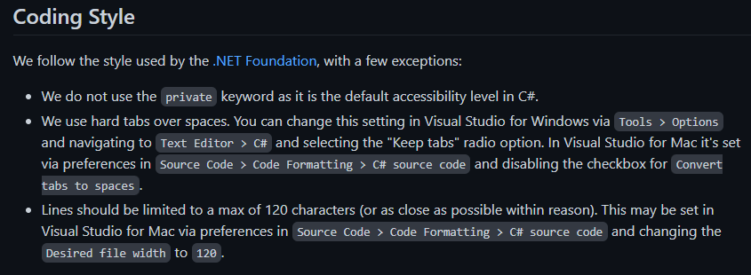
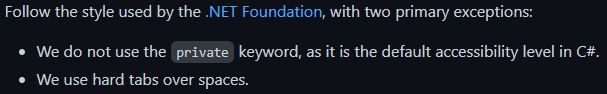

# **Guía de estilo de XAML (Xamarin.Forms/Maui)**

# Declinación de responsabilidades
Al pasar esta guía a escrito pueden surgir contradicciones, inexactitudes y aspectos no tenidos en cuenta entre otras cosas. Durante años no hemos necesitado tenerla por escrito para hacer un código limpio y similar entre nosotros. Confía en tu instinto y piensa en como te gustaría encontrarte el código si llegases nuevo al proyecto.

Esta guía se presenta **únicamente como guía de orientación** y para plasmar el estilo de XAML que durante años hemos usado algunos compañeros y yo. Siéntate antes con tu equipo y hablad que estilo, normas o reglas váis a seguir. 

# Motivación

## No romper nada.
Con esta guía de estilo no pretendo romper algunas convenciones *no escritas* que tiene el XAML (Como el uso de una linea por cada namespace en el objeto principal del archivo). Sino recoger y escribir las normas comunes y añadir aquellas para las que nada se ha establecido.

**Y por supuesto, no dudes en abrir una *issue* o presentar un *pull request* si crees que se puede mejorar.**

## Guías oficiales.

Uno de los motivos para escribir está guía es que no he encontrado guías "*oficiales*" o "*standars*" para seguir un estándar apropiado para escritura de XAML al diseñar pantallas o controles en **Xamarin.Forms** o Maui. 

No hay tales indicaciones explicitas para el XAML en los GitHubs oficiales de **Xamarin.Forms** o **Maui**, sino que sólo indicaciones basadas en las [reglas de la .NetFundation](https://github.com/dotnet/runtime/blob/main/docs/coding-guidelines/coding-style.md) para C#.

En el GitHub oficial de **Xamarin.Forms** se limita a seguirlas con 3 excepciones que explican aquí: [Coding style en Xamarin.Forms](https://github.com/xamarin/Xamarin.Forms#coding-style).

En [el caso de Maui](https://github.com/dotnet/maui/blob/main/.github/CONTRIBUTING.md#what-to-work-on), es aún más reducido y lo han limitado a las dos primeras excepciones que se explican en el Xamarin.Forms.

De las tres mostradas, la primera de ellas es ya común con XAML, ya que no se suele añadir [`x:FieldModifier="Private"`](https://docs.microsoft.com/es-es/dotnet/maui/xaml/field-modifiers) en nuestros controles, pero las otras dos indicadas para **Xamarin.Forms** las adoptaremos y explicaremos en nuestra guía de estilo.

## La Realidad.

# Reglas.

## Tabulaciones antes que espacios.

## Saltos de línea.
1. ### Longitud de linea.
2. ### Saltos de línea en bindings.

## Orden
1. ### Argumentos, diccionarios y propiedades
3. ### Organización de las propiedades dentro del control.
   1. #### Identificadores.
   2. #### Propiedades del padre.
   3. #### Propiedades propias del control.
   4. #### Propiedades comunes.
   5. #### Diseño del control.
   6. #### Posición del control.

## Nada está escrito en piedra pero ten sentido común.

Hasta el día de hoy, todas y cada una de las reglas, guías de estilo o estilos de código, han tenido sus excepciones de cuando no usarlas sin que ello conlleve la destrucción del universo conocido.

> Hasta la regla del código limpio y legible puedes saltártela cuando le haces un **minify** a un fichero o si **ofuscas** el código justo antes de compilarlo.

Con esto no quiero decir que puedas obviar las reglas sin razón ni motivo. Pondremos aquí algunos ejemplos de algunas variantes básicas que podría tomar la guía para no ser tan estricta. Aquí dependerá de vuestro equipo decidir si se quieren aplicar estas excepciones o no.

# Variantes de la guía de estilo.
## Regla de los saltos de linea.
## Regla de la organización de propiedades.
- ### Padre antes que el hijo.
- ### Posición pesa más que padre.

# Conclusión
